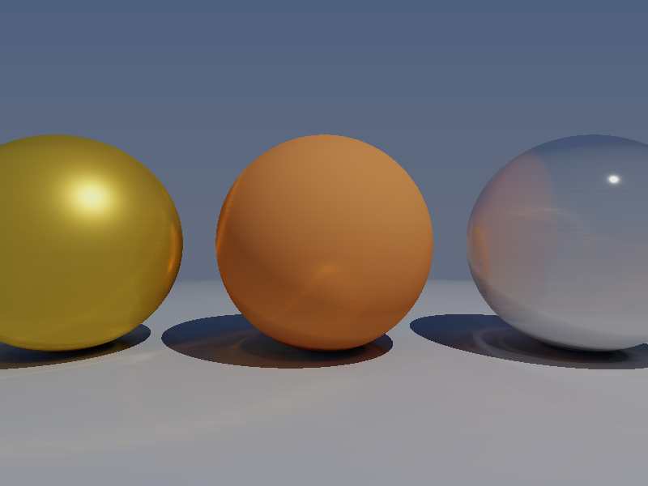

# WebGPU Path Tracer

A real-time path tracer running entirely in the browser via WebGPU compute shaders. No plugins, no native builds — just open it in Chrome or Edge and it runs on your GPU.

**[Live Demo](https://raytracer.hunter-marshall.com)** · **[Source](https://github.com/Lorithan/raytrace-webgpu)**



---

## Features

- **Path tracing with multiple bounces** — rays recursively bounce through the scene, naturally producing soft shadows, indirect illumination, and color bleeding between surfaces
- **Cook-Torrance PBR shading** — physically based materials with configurable albedo, metallic, and roughness parameters, implemented via the GGX normal distribution function, Schlick Fresnel approximation, and Smith geometry term
- **Next event estimation** — explicit shadow rays toward the light source at each bounce, combined with indirect cosine-weighted hemisphere sampling, for efficient convergence with both direct and indirect lighting
- **Progressive accumulation** — samples accumulate across frames using a ping-pong texture strategy, with Reinhard tone mapping for HDR-to-display conversion
- **Orbit camera controls** — mouse drag to rotate, scroll to zoom, WASD to pan, Q/E to move vertically

---

## How It Works

Each frame, a WebGPU compute shader dispatches one thread per pixel. Each thread:

1. Constructs a ray through its pixel using the camera's basis vectors
2. Traces the ray through the scene, testing against all spheres
3. At each hit, samples the Cook-Torrance BRDF for direct lighting and scatters a new ray in a cosine-weighted random direction for indirect lighting
4. Accumulates throughput across up to 5 bounces
5. Blends the result into a running average stored in a floating-point accumulation texture

A separate render pipeline blits the accumulation texture to the canvas each frame, applying Reinhard tone mapping in the fragment shader.

Random numbers are generated per-pixel per-frame using an XOR-shift hash seeded by pixel coordinates, frame count, and bounce index, ensuring different samples each frame for progressive convergence.

---

## Technical Details

| | |
|---|---|
| **API** | WebGPU |
| **Shading language** | WGSL |
| **Language** | TypeScript |
| **Bundler** | Vite |
| **Geometry** | Analytic ray-sphere intersection |
| **Lighting** | Point light with next event estimation |
| **BRDF** | Cook-Torrance (GGX + Schlick + Smith) |
| **Sampling** | Cosine-weighted hemisphere sampling |
| **Accumulation** | Progressive, ping-pong float32 textures |
| **Tone mapping** | Reinhard |

---

## Running Locally

Requires Node.js and a browser with WebGPU support (Chrome 113+ or Edge 113+).

```bash
git clone https://github.com/Lorithan/raytrace-webgpu
cd raytrace-webgpu
npm install
npm run dev
```

Then open `http://localhost:5173` in Chrome or Edge.

---

## Controls

| Input | Action |
|---|---|
| Mouse drag | Orbit camera |
| Scroll wheel | Zoom in / out |
| W / S | Pan forward / back |
| A / D | Pan left / right |
| Q / E | Move up / down |

---

## Scene

The default scene contains three spheres demonstrating distinct PBR material configurations — a matte diffuse surface, a rough metallic surface, and a polished mirror-like metal — placed above a large ground sphere. A single point light provides direct illumination, with the sky gradient contributing indirect lighting through bounced rays.